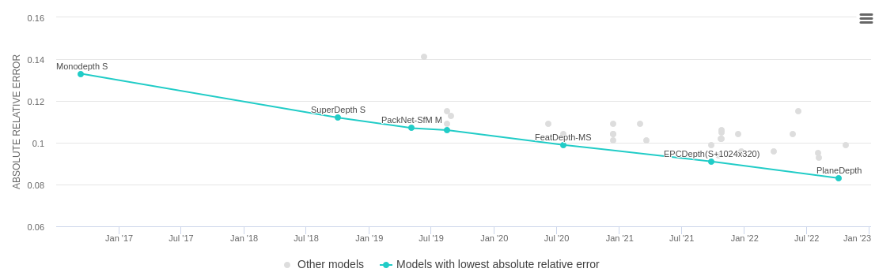
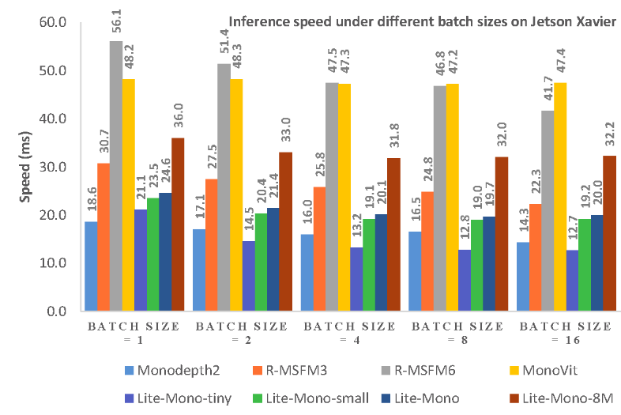

# Lite-Mono Reproduction

In this blog, we are investigating the properties of the algorithm of: "Lite-Mono: A Lightweight CNN and Transformer Architecture for Self-Supervised Monocular Depth Estimation". We are evaluating for which use cases it is adequate, and its performance characteristics. We describe the place it takes in the monocular depth-estimation ecosystem, describe the process of setting it up and provide several points of criticism. Lastly, an evaluation of the results is given, and a conclusion is made. 

### Learning Method
Firstly, what is the purpose of this project? It uses self-supervised learning to estimate depth from single, monocular videos. Self-supervised computer vision is not new, one famous example is the 2005 DARPA challenge, wherein Stanley from the Stanford team succesfully managed to use ground truth data from its Lidar sensor to update its self-learned depth estimation. The first case of monocular depth estimation was using supervised learning, and already from 2004. MonoDepth in 2017 was the first method using self-supervised depth.

In general, for learning to estimate depth from monocular images, 3 methods are widely used:
- The first one is to use ground truth data. This ground truth data can be obtained in a multitude of ways. One example is by using corresponding Lidar data which is used to know the exact depth, and the parameters are then trained to match this as closely as possible. A popular example of this is the Middlebury dataset. 
- The second method involves using stereo vision to estimate the "ground truth". Stereo vision is ubiquitus in nature. There is only one species on Earth with a single eye; the Cyclops water fleas (aptly named after the eye-oned mythological Greek Cyclops). All other animals relying on vision use stereo vision. While redundancy plays a role, stereo vision is the main advantage of a second eye. Stereo vision allows for disparity to be found between the left and right image, and if the distance between the cameras is known, this disparity can be used to exactly know the distance to an object. It should be noted however that stereo vision is still not yet fully solved; occurences such as occlusion prevent perfect matching betwen the left and right image. Nevertheless, many projects rely on stereo vision for providing the "ground truth". 
- The third option is to use videos from a single camera to provide the ground truth. Once the ego-motion is known between each frame the spatial dependency is known, and the depth can be found. This is the method used in the Lite-Mono project. However, this ego-motion needs to be estimated between images. Lite-Mono follows in the footsteps of MonoDepth, which uses a pre-trained pose-decoder to find this information. 

In summary, three commonly used methods for learning monocular depth from images are using ground-truth information (for example Lidar data), the second option is self-supervised depth from stereo vision, and the third option is self-supervised frames by single videos. The first option is more accurate than the others (which can be seen in the latest rankings, https://paperswithcode.com/task/monocular-depth-estimation; supervised methods still perform better than those self-supervised. However, self-supervised learning is suitable for applications wherein ground-truth data is not available. 

### Architecture
Convolutional Neural Networks (CNNs) have been popular for a long time, and have seen a huge surge in popularity since the advent of AlexNet (2012). CNNs capture local features by sliding an image kernel over the image at various resolutions. The information of the consecutive convolutions is then combined on one final image. 

The transformer architecture, however, has been first publicised in December 2017 and has grown rapidly in popularity. In 2018, the first vision transformer (VIT) was published in 2018 in: "An image is worth 16x16 words". Transformers use self-attention to relate the information between all pixels on a global level. This allows them to capture global information, at the offset of higher computational complexity. Subsuquent models have tried to combine the data effiency of CNN's with the ability to capture global information from transformers. This is also the case for Lite-Mono. It first downscales the image, then it extracts local features using convolution, then it links these global features using transformer blocks. 

### Related work
Other projects exist for monocular depth estimation. DepthFormer (https://arxiv.org/pdf/2203.14211.pdf) for example is the most robust to noise corruption according to the RoboDepth challenge (https://github.com/ldkong1205/RoboDepth) Furthermore, it claims that using convolutions and then the transformer block results in limited capability by the model to assess global information, and thus implemented the opposite. We assumed that Lite-Mono chose this approach to save computational costs, which was indeed confirmed by the author. PlaneDepth (https://arxiv.org/pdf/2210.01612v3.pdf) and MonoViT (https://paperswithcode.com/paper/monovit-self-supervised-monocular-depth) are examples of algorithms performing with higher accuraces. The timeline of the increase in accuracy of monocular self-supervised algorithms has been provided below. It should be noted that Lite-Mono has not yet been scored; one possible cause of this is certain issues which arise when reproducing the project. 

## Experience setting it up
One of the first steps in this reproduction was to obtain the KITTI dataset so that we could start training the model. This turned out to be non-trivial due to the size of the compressed dataset (~145 GB)  and the significant CPU effort and time that was required to expand the compressed folder.

For the first attempt, after initial uncompressing and preparation of the code provided through the GitHub repo, we ran into issues attempting to train with a certain folder of footage (driving near campus) where we waited for a very long time with no visible changes or results. Initially, we thought that this was to be expected while waiting for training however we found out a while later that for some reason, the training did not start/continue correctly. We also saw that CUDA was not being used despite the toolkit being installed and ready to be used.

We then proceeded to consider whether we would be able to use cloud based platforms such as a Google Cloud Virtual Machine or Google Colab, but it was soon decided that these would not work well with the limited free storage space available for us to download and store KITTI while training.

We then asked permission from the VR Zone at the TU Delft Library to make use of one of their workstations with a NVIDIA RTX 3080 GPU and sufficient local storage space. The KITTI dataset was downloaded and decompressed once again. These operations alone took over 10 hours due to the size of the dataset. Once the dataset was ready, we set up the Python dependencies using the documentted working tested versions of Python runtime, Torch+Cuda runtime and other dependencies, as listed on the Monodepth2 GitHub readme.

During the first attempt, we obtained an obscure issue with a feature decrepated from Numpy version 19.5 onwards. We then downgraded Numpy to a lower version where this error did not occur. Then, in our second attempt, with the default settings of a batch size of 12, we got the infamous CUDA out of memory error. This error occurs when either the GPU does not have enough memory to process the number of batches selected or because there is another underlying issue beneath. In our case, it looked like the former, as we were using a NVIDIA RTX 3080 GPU with 10 GB VRAM.

We then proceeded to find that a batch size of 6 *finally* allowed the training to start. But soon after, we read that using a batch size lower than 12 was not going to be good for gradient descent due to increased noise and less accurate estimates, and would take longer to run to achieve similar results to running with a larger batch size.

What we found strange is that we were able to see the authors replicate their training on a GPU very similar to the NVIDIA RTX 3080 -slightly worse even- than we were attempting to use. After unsuccessful attempts to try different versions of Python and Torch, we decided to explore another avenue for training and testing.

The initial candidates were using a Google Cloud Virtual Machine with GPU resources or using Google Colab. The main issues with both of these options were the costs associated with using them. Even with credit which we could obtain, that wouldn't be enough for any meaningful training and evaluation. Apart from issues with cost of running these, another minor issue would be that the initial tedious work of preparing the dataset for a third time. There was a final option which ended up opting for, which was to use DelftBlue (the TU Delft supercomputer). 

DelftBlue has GPU nodes with NVIDIA V100 GPUs which would be more than sufficient for our needs. And setting up the dataset would be very trivial, as we could easily copy the KITTI dataset over the internal TU Delft network over to the DelftBlue scratch disk. This saved us a lot of time in the long run.

While we originally thought that DelftBlue would be straightforward to setup, unfortunately this was far from the case. We tried to use the module system on DelftBlue with the recommended Python 3.8.12 and PyTorch, however this did not work out of the box, with a similar NumPy error and other issues.

Due to limitations with access rights, we were not allowed to directly install Python 3.6 as we intended on the system, therefore we had to build it from scratch and install it in a local folder. Once this was done, and similar versions installed of the Python modules (PyTorch, Numpy) as was working on the VR Zone PC, we started testing. We had a couple of issues in the process: first at some point installing pip modules was not working due to issues with the cache files associated with pip. Clearing the cache helped here. We also has issues once again with CUDA giving the 'out of memory' error with our local version of Python 3.6; this was likely due to the mismatch of CUDA runtime on the DelftBlue cluster and the PyTorch version we were using.

Lastly, in order to submit jobs, we needed to write specific shell scripts from scratch using the sbatch system of submitting jobs. The problem was that the number of GPU nodes available (10) was far lower than the number of CPU nodes (256) and this meant that obtaining GPU time to run the jobs easily took hours, only for them to either fail with an obscure issue or get killed because of the resources needed not being mentioned correctly. We remedied part of the problem by testing to see if the script worked on of the cpu nodes, and then trying it on the gpu. However, sometimes a single person would submit 120 jobs at the same time, still clogging the compute partition. Furthermore, CUDA-specific errors could not be resolved in this manner. 

Running with the sbatch system also was very different to directly running train.py since we needed to take care regarding standard output and error logging. This was handled by using custom log files where stderr and stdout were routed into them.

In the end, after consulting with the author of the paper for the correct working versions of Python and PyTorch to run the training and evaluation, we were able to directly use the Python module available on DelftBlue along with the custom versions of PyTorch, Numpy and other dependencies installed as user packages, in order to finally successfully start training with the ideal parameter of batch size of 12.

However, strangely it seems like the code has not optimized for high-performance GPU's. This was noticed first on the VR-Zone computer. The Nvidia RTX 3080 is, according to benchmarks, ~40% faster than the Titan Xp used in the original project. However, training 30 epochs still took 15 hours; exactly the same amount of time. Furthermore, we expected the Tesla V100s (32GB), which has about 125 TFLOPS, to vastly outperform the Titan Xp (12 TFLOPS). In reality however, the training took much _longer:_ after the maximum time limit of 24 hours it had only ran for 26 epochs.  Why exactly it takes the DelftBlue _supercomputer_ longer to run this model than a TITAN Xp we do not know, but that was a very disappointing realization. 

## Evaluation
To perform the evaluation, we first generated the ground truth depth maps using a script found in the MonoDepth GitHub repository. The script itself geenrates the depth maps using the KITTI dataset and eigen splits.

We first performed the evaluation of the most successful training run with the highest number of epochs, which was 27 epochs with a learning rate of 0.0001. We compare the results of the evaluation with the results produced in the paper, where 30 epochs were used. Table 1 comparing the two is shown below.

**Table 1: Comparison evaluation results between reproduced trained model and original trained model**
| **Model**                  | **abs_rel** | **sq_rel** | **rmse** | **rmse_log** | **a1** | **a2** | **a3** |
|----------------------------|-------------|------------|----------|--------------|--------|--------|--------|
| **Lite-Mono-Reproduction** | 0.135       | 1.072      | 5.237    | 0.213        | 0.838  | 0.945  | 0.977  |
| **Lite-Mono (original)**   | 0.121       | 0.876      | 4.918    | 0.199        | 0.859  | 0.953  | 0.980  |

We can see that our reproduced trained model is relatively close to the original model and appears to be converging towards the results shown in the paper. They are not very close and this is to be expected as we are comparing results between 27 epochs (ours) and 30 epochs (original). Even with this in mind, one could say that the change in error should be smaller with increasing epoch, and this something that could be further investigated.

In addition, we compare results from epoch 3 of both the VR Zone PC (NVIDIA RTX 3080 10 GB) and DelftBlue GPU (NVIDIA V100S 32 GB) in Table 2.

**Table 2: Comparison evaluation results between VR Zone PC and DelftBlue GPU**
| **Model**                              | **abs_rel** | **sq_rel** | **rmse** | **rmse_log** | **a1** | **a2** | **a3** |
|----------------------------------------|-------------|------------|----------|--------------|--------|--------|--------|
| **VR Zone PC** | 0.171       | 1.327      | 5.718    | 0.243        | 0.770  | 0.922  | 0.969  |
| **DelftBlue GPU** | 0.170       | 1.294      | 6.444    | 0.260        | 0.744  | 0.903  | 0.964  |

As can be expected, abs_rel and sq_rel are lower (marginally) on the DelftBlue side, however the VR Zone PC has a overall lower rmse. Further investigation needs to take place to better explore why we get this result.

### Criticism 
There are various problems with the project. The first is the unclear use case; it is trained on the KITTI dataset, which is for self-driving cars. However, cars can afford to bring a larger payload, thus very high efficiency is not required. Thus, putting this lightweight structure on a drone or mobile phone would make more sense, however it has not been trained for such situations (indoor/outdoor flying or walking applications), so it is impossible to judge its performance in these scenarios.

The above image is provided on the Github page of the project. However, we have three points of criticism:
 - First, while training speed is important for tweaking the hyperparameters, the main use case is in the inference speed is low compared to other algorithm. The problem is that this is done using Python. The paper claims that MonoVit has the second highest inference speed (so, the speed it takes to estimate depth on a single image for a trained image). However, looking at the code of MonoViT it is clear that there are a lot of if-statements, which are inherently very slow in an interpreted language as python. Something many companies do, such as Tesla, is developing and training their neural networks using python, and then embedding this trained network in C++. Thus, comparing the inference speeds in python is disingenious. 

 - Second, using batch normalization on very low batch sizes creates very large errors (https://arxiv.org/pdf/1803.08494.pdf) and can thus be seen as a bad practice.
 
 - Third is that it compares itself to MonoDepth2:, a paper from 5 years earlier (a century in Deep Learning time). This is not necesarily bad, but since then many better algorithms have emerged, making it an unfair comparison.

### Conclusion
We would not necessarily advise using this algorithm. It performs worse in terms of accuracy than a multitude of other algorithms([SwinV2-L 1K-MIM](https://paperswithcode.com/paper/revealing-the-dark-secrets-of-masked-image), [URCDC-Depth](https://paperswithcode.com/paper/urcdc-depth-uncertainty-rectified-cross)), and is not as robust to noise. Furthermore, the purpose of this algorithm is to provide for a low inference time, but this has not yet been tested on actual embedded devices, or on C++. If you decide to use it however, make sure to have enough space to download the KITTI dataset to and decompress it (325GB, but the compressed partition can be deleted afterwards), to install the proper dependencies. Lastly, it can be worthwhile to optimize the code to better run on modern, high-performing GPU's. 

In the future we would like to specifically compare Lite-Mono to [DepthFormer](https://arxiv.org/abs/2203.14211) as it uses a very similar architecture, but with the convolution and transformer blocks switched. Furthermore, it would be very interesting to evaluate the inference speed of the trained neural network in C++. Lastly, our original intention was to perform a grid search to find the best hyperparameters (such as the learning rate), and compare different ablation options. We did however not get to this, due to the vast multitude of setbacks throughout the project. 
